# GitLab Observability Dashboards - Mermaid Format

I've successfully converted all 4 dashboard wireframes into Mermaid diagram format. Here are the structured representations of each dashboard:

## Dashboard 1: Customer-Facing Status Page

```mermaid
flowchart TD
    A[GitLab Status Page] --> B[Header Navigation]
    A --> C[Overall System Status Banner]
    A --> D[Service Status Grid]
    A --> E[Active Incidents Panel]
    A --> F[Historical Performance]
    A --> G[Maintenance Schedule]
    A --> H[Notification Preferences]
    
    B --> B1[GitLab Logo]
    B --> B2[Home]
    B --> B3[History]
    B --> B4[Subscribe]
    
    C --> C1[System Status: Operational]
    C --> C2[Last Updated: timestamp]
    
    D --> D1[Git Operations: ✅ Operational]
    D --> D2[CI/CD Pipelines: ⚠️ Degraded Performance]
    D --> D3[Web Interface: ✅ Operational]
    D --> D4[API Services: ✅ Operational]
    D --> D5[Container Registry: ✅ Operational]
    D --> D6[Package Registry: ✅ Operational]
    
    E --> E1[Current Incidents]
    E --> E2[Incident Timeline]
    E --> E3[Impact Level Indicators]
    
    F --> F1[30-day Uptime: 99.95%]
    F --> F2[90-day Uptime: 99.92%]
    F --> F3[Uptime Chart]
    
    G --> G1[Upcoming Maintenance]
    G --> G2[Maintenance Calendar]
    
    H --> H1[Email Notifications]
    H --> H2[SMS Alerts]
    H --> H3[Webhook Integration]
    H --> H4[RSS Feed]
```

## Dashboard 2: Usage Data Analytics

```mermaid
flowchart TD
    A[GitLab Usage Analytics Dashboard] --> B[Top Navigation]
    A --> C[Key Metrics Row]
    A --> D[User Activity Section]
    A --> E[Repository Insights]
    A --> F[CI/CD Analytics]
    A --> G[Feature Adoption]
    
    B --> B1[Dashboard]
    B --> B2[Reports]
    B --> B3[Export]
    B --> B4[Settings]
    B --> B5[Date Range Selector]
    
    C --> C1[Active Users: 12,543]
    C --> C2[Total Repositories: 8,921]
    C --> C3[Pipeline Runs: 45,234]
    C --> C4[Storage Used: 2.3TB]
    
    D --> D1[User Sessions Chart]
    D --> D2[Login Frequency Graph]
    D --> D3[Geographic Distribution Map]
    D --> D4[User Engagement Heatmap]
    
    E --> E1[Repository Creation Trends]
    E --> E2[Commit Activity Graph]
    E --> E3[Merge Request Statistics]
    E --> E4[Code Review Metrics]
    
    F --> F1[Pipeline Success Rate: 89%]
    F --> F2[Average Build Time: 12m]
    F --> F3[Deployment Frequency Chart]
    F --> F4[Failed Pipeline Analysis]
    
    G --> G1[Feature Usage Matrix]
    G --> G2[Adoption Rate Trends]
    G --> G3[User Journey Analytics]
    G --> G4[License Utilization]
```

## Dashboard 3: Services and Microservices Status

```mermaid
flowchart TD
    A[Microservices Status Dashboard] --> B[Navigation Bar]
    A --> C[Service Health Overview]
    A --> D[Service Dependency Map]
    A --> E[API Endpoint Monitoring]
    A --> F[Distributed Tracing]
    A --> G[Alert Management]
    
    B --> B1[Services]
    B --> B2[Dependencies]
    B --> B3[Tracing]
    B --> B4[Alerts]
    B --> B5[Configuration]
    
    C --> C1[Service Grid Matrix]
    C --> C2[Health Score Indicators]
    C --> C3[Service Status Legend]
    
    C1 --> C1A[Auth Service: ✅ Healthy]
    C1 --> C1B[User Service: ⚠️ Warning]
    C1 --> C1C[Repository Service: ✅ Healthy]
    C1 --> C1D[CI Service: ❌ Critical]
    C1 --> C1E[Notification Service: ✅ Healthy]
    C1 --> C1F[Storage Service: ✅ Healthy]
    
    D --> D1[Service Network Graph]
    D --> D2[Dependency Relationships]
    D --> D3[Circuit Breaker Status]
    D --> D4[Service Load Balancing]
    
    E --> E1[API Response Times]
    E --> E2[Request Rate Graphs]
    E --> E3[Error Rate Monitoring]
    E --> E4[Endpoint Health Matrix]
    
    F --> F1[Request Flow Timeline]
    F --> F2[Span Duration Analysis]
    F --> F3[Error Trace Details]
    F --> F4[Performance Bottlenecks]
    
    G --> G1[Active Alerts Panel]
    G --> G2[Alert Severity Levels]
    G --> G3[Escalation Rules]
    G --> G4[Acknowledgment Status]
```

## Dashboard 4: Infrastructure Metrics

```mermaid
flowchart TD
    A[Infrastructure Metrics Dashboard] --> B[Navigation Menu]
    A --> C[System Overview]
    A --> D[Compute Resources]
    A --> E[Network Metrics]
    A --> F[Storage Systems]
    A --> G[Database Monitoring]
    A --> H[Alert Dashboard]
    
    B --> B1[Overview]
    B --> B2[Servers]
    B --> B3[Network]
    B --> B4[Storage]
    B --> B5[Databases]
    B --> B6[Alerts]
    
    C --> C1[Infrastructure Health Score]
    C --> C2[Total Servers: 45]
    C --> C3[Active Alerts: 3]
    C --> C4[System Uptime: 99.8%]
    
    D --> D1[CPU Utilization Gauges]
    D --> D2[Memory Usage Charts]
    D --> D3[Load Average Graphs]
    D --> D4[Process Monitoring]
    
    D1 --> D1A[Server-01: 65% CPU]
    D1 --> D1B[Server-02: 78% CPU]
    D1 --> D1C[Server-03: 45% CPU]
    
    D2 --> D2A[Memory Usage: 12GB/32GB]
    D2 --> D2B[Swap Usage: 2GB/8GB]
    D2 --> D2C[Memory Trends Graph]
    
    E --> E1[Network Traffic Graphs]
    E --> E2[Bandwidth Utilization]
    E --> E3[Packet Loss Monitoring]
    E --> E4[Latency Measurements]
    
    F --> F1[Disk Usage by Mount Point]
    F --> F2[I/O Performance Metrics]
    F --> F3[Storage Capacity Trends]
    F --> F4[Backup Status Panel]
    
    G --> G1[Database Connection Pools]
    G --> G2[Query Performance Metrics]
    G --> G3[Replication Status]
    G --> G4[Index Usage Statistics]
    
    H --> H1[Critical Alerts: 1]
    H --> H2[Warning Alerts: 2]
    H --> H3[Alert Timeline]
    H --> H4[Notification Settings]
```

These Mermaid diagrams represent the structure and hierarchy of each dashboard, showing the relationships between different components and sections. Each diagram can be:

- **Rendered directly** in GitHub, GitLab, or any Mermaid-compatible markdown viewer
- **Used for documentation** and technical specifications
- **Modified easily** to reflect implementation changes
- **Integrated** into development workflows and project planning

The diagrams maintain the same hierarchical structure as the original wireframes while providing a text-based format that's version-controllable and easy to collaborate on with development teams.
[^1]

⁂

[^1]: https://ppl-ai-code-interpreter-files.s3.amazonaws.com/web/direct-files/364a0fed3625a2f727ee17af2d89b7d6/54ea1b76-9267-48ce-b2a7-1ffa66515719/ff26e84b.md

